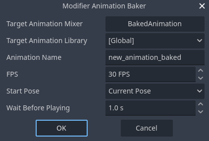

#  Modifier Animation Baker

Bake IK Animation into FK Animation.

## How to Use

1. Enable ModifierAnimationBaker plugin
2. Select one AnimationPlayer on SceneTreeDock
3. Run ModifierAnimationBaker in `Project > Tools > Modifier Animation Baker...`
4. Select target AnimationMixer and AnimationLibrary on the dialog
5. Set other options and accept dialog

### Notes

Target animation mixer must have RESET animation to make a list of baking bones, also must have editable (not imported) AnimationLibrary.
